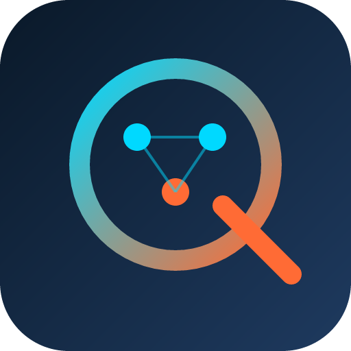

# Qradha - Quantum Resilient Adaptive Dynamic Hamburg Engine



**Real-time intermodal port synchronization and optimization platform for the Port of Hamburg**

## Overview

Qradha transforms 12+ hour delay cascades into <30 second real-time re-optimizations, achieving:
- **8-12% terminal throughput increases**
- **15% gantry crane energy reductions**
- **50%+ rail modal share** (EU sustainability targets)

## Features

### 🗺️ Live Port Map
- Real-time vessel tracking with MapLibre GL
- Color-coded berth status (available/occupied/congested)
- Interactive vessel and berth details

### 🤖 AI-Powered Disruption Handling
- Natural language disruption input
- Automatic parsing via Groq LLMs
- Intelligent scenario generation

### ⚡ Quantum-Inspired Optimization
- Simulated annealing with tensor network representation
- Multi-objective cost function optimization
- Sub-30 second re-scheduling

### 📊 Real-Time Metrics
- Throughput, energy, emissions tracking
- Resilience score monitoring
- Risk alerts and recommendations

### 🎨 3D Visualization
- Energy landscape visualization
- Quantum tunneling animation
- Container yard view

## Tech Stack

- **Frontend:** Next.js 16, React 18, TypeScript
- **3D Graphics:** Three.js, React Three Fiber
- **Maps:** MapLibre GL
- **State Management:** Zustand
- **Animations:** Framer Motion
- **Desktop:** Tauri (Rust)
- **AI Agents:** Groq LLMs

## Getting Started

### Prerequisites
- Node.js 18+
- Rust 1.70+ (for desktop builds)

### Installation

```bash
# Clone the repository
git clone https://github.com/quantumulator/qradha-prototype.git
cd qradha-prototype

# Install dependencies
npm install

# Run development server
npm run dev
```

Open [http://localhost:3000](http://localhost:3000) with your browser to see the result.

### Build

```bash
# Web build
npm run build

# Desktop build (Windows)
npm run tauri:build
```

## Project Structure

```
├── app/                    # Next.js app router
│   ├── page.tsx           # Main dashboard
│   ├── layout.tsx         # Root layout
│   └── globals.css        # Global styles
├── components/            # React components
│   ├── PortMap.tsx        # MapLibre map component
│   ├── QuantumVisualization.tsx  # 3D visualization
│   ├── MetricsPanel.tsx   # KPI dashboard
│   ├── ChatPanel.tsx      # AI chat interface
│   ├── DisruptionPanel.tsx # Disruption input
│   ├── VesselList.tsx     # Vessel queue
│   └── Header.tsx         # Navigation header
├── lib/                   # Utilities
│   ├── store.ts           # Zustand store
│   ├── types.ts           # TypeScript types
│   └── mock-data.ts       # Demo data
├── src-tauri/             # Tauri (Rust) backend
│   ├── src/main.rs        # Rust entry point
│   └── tauri.conf.json    # Tauri config
└── public/                # Static assets
```

## Documentation

- [Technical Context](./context.md) - Full technical architecture
- [AI Agents](./agents.md) - AI agent system documentation

## Deploy on Vercel

The easiest way to deploy your Next.js app is to use the [Vercel Platform](https://vercel.com/new?utm_medium=default-template&filter=next.js&utm_source=create-next-app&utm_campaign=create-next-app-readme).

## License

MIT License

---

*Built for the Port of Hamburg 🚢⚡*
